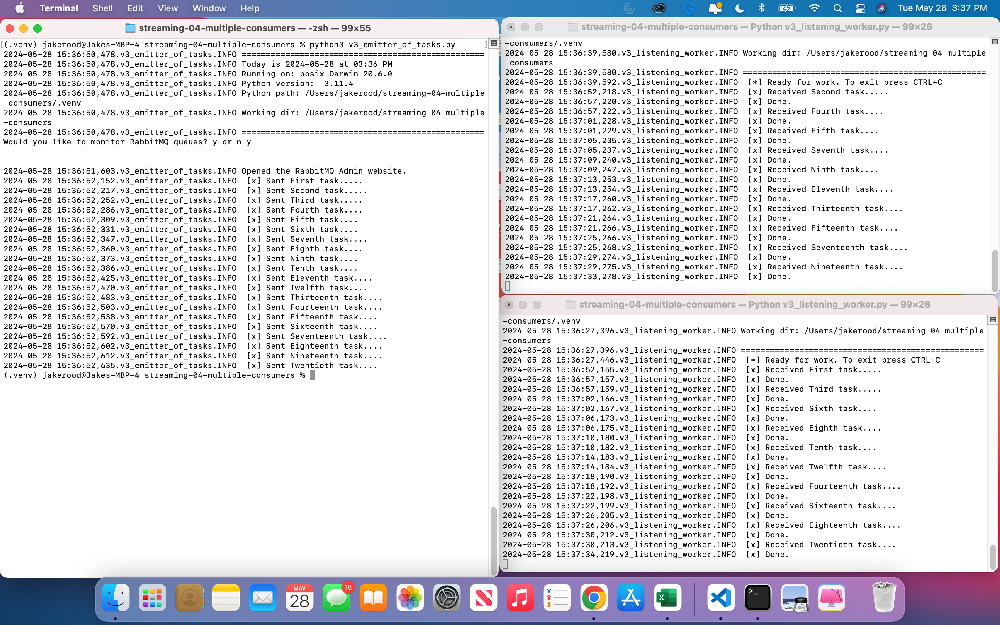

# streaming-04-multiple-consumers
Name: Jake Rood

Date: May 28, 2024

> Use RabbitMQ to distribute tasks to multiple workers

One process will create task messages. Multiple worker processes will share the work.

## Prerequisites

1. Git
1. Python 3.7+ (3.11+ preferred)
1. VS Code Editor
1. RabbitMQ Server installed and running locally

## Before You Begin

1. Fork this starter repo into your GitHub.
1. Clone your repo down to your machine.
1. View / Command Palette - then Python: Select Interpreter
1. Select your conda environment.

## Create a Python Virtual Environment

We will create a local Python virtual environment to isolate our project's third-party dependencies from other projects.

1. Open a terminal window in VS Code.
1. Use the built-in Python utility venv to create a new virtual environment named `.venv` in the current directory.

```shell
python3 -m venv .venv
```

Verify you get a new .venv directory in your project. 
We use .venv as the name to keep it away from our project files. 

## Activate the Virtual Environment

In the same VS Code terminal window, activate the virtual environment. On MacOS:

```shell
source .venv/bin/activate
```

Verify you see the virtual environment name (.venv) in your terminal prompt.

## Install Dependencies into the Virtual Environment

To work with RabbitMQ, we need to install the pika library.
A library is a collection of code that we can use in our own code.

We keep the list of third-party libraries needed in a file named requirements.txt.
Use the pip utility to install the libraries listed in requirements.txt into our active virtual environment. 

Make sure you can see the .venv name in your terminal prompt before running this command.

```shell
python3 -m pip install -r requirements.txt
```

## Read

1. Read the [RabbitMQ Tutorial - Work Queues](https://www.rabbitmq.com/tutorials/tutorial-two-python.html)
1. Read the code and comments in this repo.

## RabbitMQ Admin 

RabbitMQ comes with an admin panel. When you run the task emitter, reply y to open it. 

(Python makes it easy to open a web page - see the code to learn how.)

## v1: Execute the Producer and Consumer/Worker

1. In one terminal, run v1_emitter_of_tasks.py to execute the producer for v1 (say y to monitor RabbitMQ queues)

```shell
python3 v1_emitter_of_tasks.py
```

2. Explore the RabbitMQ website.

1. In a different terminal, run v1_listening_worker.py to execute the consumer/worker for v1

```shell
python3 v1_listening_worker.py
```

Use CTRL+C to terminate the worker when finished

## v2: Execute the Producer and Consumer/Worker

1. In one terminal, run v2_emitter_of_tasks.py (say y to monitor RabbitMQ queues) to execute the producer for v2

```shell
python3 v2_emitter_of_tasks.py
```

2. In a different terminal, run v2_listening_worker.py to execute the consumer/worker for v2

```shell
python3 v2_listening_worker.py
```

Use CTRL+C to terminate the worker when finished

## v3: Execute the Producer and Multiple Consumers/Workers

1. In one terminal, use v3_emitter_of_tasks.py to produce task messages from the tasks.csv file.

```shell
python3 v3_emitter_of_tasks.py
```

2. Open at least two other terminals

1. In each of the new terminals, run the v3_listening_worker.py script to launch multiple consumers/workers.

```shell
python3 v3_listening_worker.py
```

## Screenshot

See a running example with 3 concurrent process windows here:



## Sync Changes to GitHub

Now it's time to get the local work you did on your machine back up to your cloud repo in GitHub:

1. On the VS Code side panel, click the source control icon (look for a blue bubble with a number in it).
1. Important! Above the Commit button, it will say "Message".
1. You MUST include a commit message.
1. Click the down arrow on the blue "Commit" button to "Commit and Push" to your GitHub repo.

Verify: Open a browser to your GitHub repo and verify the changes have appeared.

Note: You can either sync all your changes at once at the end of the project **OR** you can sync your changes after completing each task individually.

## Reference

- [RabbitMQ Tutorial - Work Queues](https://www.rabbitmq.com/tutorials/tutorial-two-python.html)
